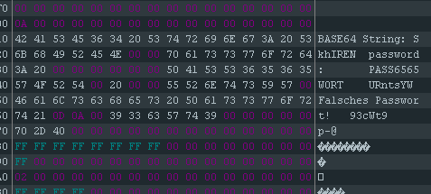

# Writeup

## Das Passwort herausfinden

Die kompilierte Datei muss mit einem Hex-Editor geöffnet werden.

Es ergibt sich folgender Anblick: 

Hier sieht man die Zeichenfolge 
    
    passwort: PASS6565WORT

Wir haben das Passwort gefunden.

## Das Flag herausfinden

Wir müssen nun das Programm mit dem Passwort ausführen.

Dies lässt sich folgendermaßen (ähnlich mit selbst kompilierten Programmen) tun:

    main.exe PASS6565WORT

Die Ausgabe sollte folgendermaßen aussehen:

    BASE64 String: SkhIRENURntsYW93cWt9

## Das Flag decoden

Wie in der Ausgabe angageben, ist das Flag BASE64 encoded.

Bei der Website [https://www.base64decode.org/](https://www.base64decode.org/)
können BASE64 encodedte Strings decoded werden.

## DAS FLAG

JHHDCTF{laowqk}